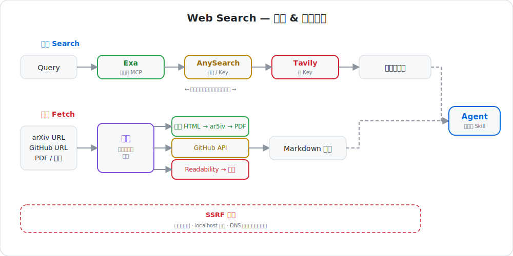

# Web-Search

<p align="right">
  <a href="./README.md">中文</a> | <a href="./README_EN.md">English</a>
</p>

<div align="center">
  <h1>🔍 Web Search</h1>
  <p><b>Search + fetch, built for AI agents, works zero-config without API keys</b></p>
  <p>
    <a href="https://github.com/Eddie0521/web-search/stargazers"></a>
    
    
    
  </p>
</div>

<br/>

<div align="center">
  
</div>

## Capabilities

| Capability | When | What it does |
| :--- | :--- | :--- |
| **Search** | The agent needs current web sources or ranked results | Cascades through Exa → AnySearch → Tavily, returning on the first successful provider |
| **Fetch** | The agent has a page, repo, PDF, or arXiv URL | Routes by content type and returns clean Markdown through specialized fallback chains |

All outbound requests pass through SSRF protection (protocol allow-list, localhost blocking, DNS private-range rejection).

## Install

```bash
npx skills add Eddie0521/web-search
```

The skill installs to the shared `~/.agents/skills/web-search` directory, auto-detected by Claude Code, Codex, Cursor, and other agents. Other skills can invoke it by path.

### Prerequisite: bun

```bash
curl -fsSL https://bun.sh/install | bash      # universal
brew install oven-sh/bun/bun                    # macOS
```

Dependencies are version-pinned via Bun imports and auto-installed — no `npm install` needed.

## Usage

### Agent invocation

Trigger naturally in conversation — the skill detects intent automatically:

- "Search for recent multi-agent world model papers" → triggers search
- "Fetch the full text of https://arxiv.org/abs/2506.18537" → triggers fetch
- "Show me the directory structure of https://github.com/torvalds/linux" → triggers fetch

### CLI

```bash
# Search (results to stdout, provider info to stderr)
bun ~/.agents/skills/web-search/search.ts "multi-agent world model"
bun ~/.agents/skills/web-search/search.ts "latest LLM news" --num 5

# Fetch (omit output path to print to stdout)
bun ~/.agents/skills/web-search/fetch.ts https://arxiv.org/abs/2506.18537 paper.md
bun ~/.agents/skills/web-search/fetch.ts https://github.com/torvalds/linux
```

### Chaining workflows

| Scenario | Flow |
|----------|------|
| **Research** | Search keywords → pick source URLs → fetch full text → pass to a writing or learning skill |
| **Paper reading** | Fetch arXiv URL → full-text fallback chain → pass to [paper-reader](https://github.com/Eddie0521/paper-reader) |
| **Repo inspection** | Fetch repo root → identify relevant files → fetch a specific file → analyze |

Chaining is explicit: each downstream skill or agent decides what to do with the returned content.

## How it works

### Search cascade

Regular search tries three engines in a fixed order, **returning immediately on the first success**:

1. **Exa** — Uses the official API with a key; falls back to a zero-config anonymous MCP endpoint without one, ready out of the box.
2. **AnySearch** — Adds auth with a key; works anonymously without one.
3. **Tavily** — Requires a key to enable; additionally supports AI-generated answer summaries and time-range filtering.

If all engines fail, a clear error is returned. API key source priority: environment variables > config file.

| Engine | Free quota | Notes |
|--------|------------|-------|
| Exa | 1,000 requests/month | Anonymous MCP works without a key; with a key, uses the official API sharing the same free quota |
| AnySearch | 1,000 requests/day | Available after registration; anonymous access works but with lower limits |
| Tavily | 1,000 credits/month | Requires a registered key; basic search costs 1 credit/request, advanced search 2 credits/request |

### Fetch routing

Different fetch routes are used depending on input type, each with multiple fallbacks:

- **arXiv papers**: Tries official HTML → ar5iv mirror → PDF extraction in order, taking the first usable full text. Local PDF files can also be parsed directly.
- **GitHub repos**: Lists directory trees or retrieves individual file contents via the GitHub API.
- **Generic PDF**: Downloads and extracts text using unpdf.
- **General web pages**: First extracts body text locally using Readability and converts to Markdown; on failure, falls back to Jina Reader and Defuddle proxy services.

Within each route, if a step fails it automatically moves to the next, maximizing the chance of getting usable content.

### SSRF protection

Before every outbound request, the target address is checked to reject local and internal network addresses. The check covers protocol allow-listing (http/https only), literal interception (localhost, etc.), and DNS-resolved real IPs — even if a domain looks normal, if it resolves to an internal address, it's blocked.

## Configuration

API keys are optional — the skill works out of the box (Exa MCP anonymous mode + AnySearch anonymous mode).

| Variable | Enables | Notes |
|----------|---------|-------|
| `EXA_API_KEY` | Exa official API | Without it, uses zero-config anonymous MCP |
| `ANYSEARCH_API_KEY` | AnySearch auth | Without it, anonymous access (lower quota) |
| `TAVILY_API_KEY` | Tavily | Without it, the engine is skipped |

```bash
export EXA_API_KEY=...
export ANYSEARCH_API_KEY=...
export TAVILY_API_KEY=...
```

Or write to `~/.claude/web-search/config.json`. Environment variables take precedence over the config file.

## Why

Traditional search engine APIs return results pages built for humans — ad slots, knowledge panels, shopping carousels — which are noise for an agent. Third-party search APIs are designed for AI agents: they return clean, ranked, ready-to-consume text snippets that drop straight into a model's context window.

Search and fetch belong together because discovering a URL is only half the job — the agent still needs the full text at that URL. Search finds the source, fetch retrieves the content, in one skill.

Multiple engines and multiple fetch paths can fail, so every layer has explicit fallbacks. This makes downstream workflows that depend on this skill more reliable.

## Uninstall

```bash
npx skills remove Eddie0521/web-search -g
```

If installed manually via `sync.sh`, remove `~/.claude/skills/web-search` and `~/.agents/skills/web-search`.

## Acknowledgments

- [waza](https://github.com/tw93/waza) — README structure and visual style inspiration
- [pi-web-access](https://pi.dev/packages/pi-web-access) — search provider design and multi-engine fallback approach
- [pi-web-suite](https://github.com/Eddie0521/pi-web-suite) — earlier extension this project is based on

## Support

- Found it useful? Give it a ⭐ Star
- Found a broken provider or unsupported content type? Open an [Issue](https://github.com/Eddie0521/web-search/issues)
- PRs welcome for fixes and improvements